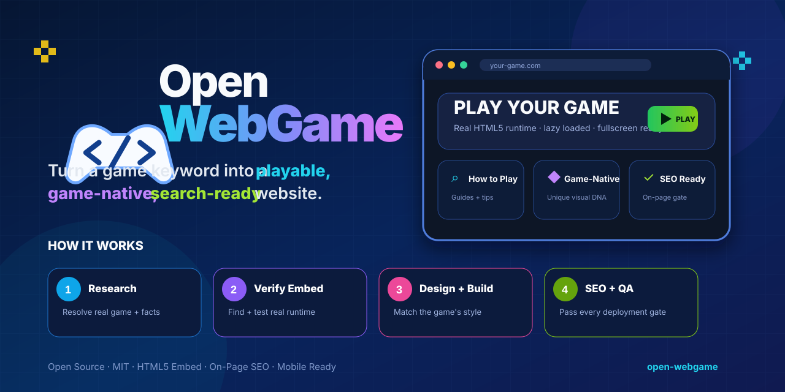

<p align="center">
  
</p>

<h1 align="center">Open WebGame</h1>

<p align="center">
  Turn a game keyword into a playable, game-native, search-ready website.
</p>

<p align="center">
  <a href="./LICENSE"></a>
  <a href="./SKILL.md"></a>
  <a href="./references/on-page-seo.md"></a>
  <a href="./references/iframe-verification.md"></a>
</p>

<p align="center">
  <a href="#quick-start">Quick Start</a> ·
  <a href="#how-it-works">How It Works</a> ·
  <a href="#example">Example</a> ·
  <a href="#on-page-seo-gate">SEO Gate</a> ·
  <a href="#contributing">Contributing</a>
</p>

[](https://github.com/foxigaoqian/open-webgame)

Open WebGame is an open-source **agent skill and production workflow** for building play-first game websites from a game keyword or official game URL.

It does not start by choosing a generic landing-page template. It first resolves the real game, finds and validates the real browser runtime when one exists, studies the game's mechanics and visual language, defines search intent, and only then generates the site.

A build is not complete just because it looks polished. **A broken game player or a failed On-Page SEO Gate means the project is not deployment-ready.**

## Features

- **Real game resolution** — identify the canonical game, developer, current status, platforms, mechanics, controls and official sources before writing copy.
- **Playable HTML5 verification** — distinguish an itch.io project page from the actual browser runtime and test third-party iframe behavior before building the full site.
- **Game-native design** — derive palette, typography mood, density, borders, shadows, texture, cards and interaction style from the current game's visual DNA.
- **Play-first architecture** — keep the playable experience near the top when embedding is verified, with reload, fullscreen and official fallback behavior.
- **Mandatory On-Page SEO** — search intent, title, H1, opening copy, canonical, crawlable content, internal links, metadata, structured data, images, robots and sitemap are part of the acceptance gate.
- **Useful supporting content** — How to Play, controls, tips, progression, FAQ and additional routes only when they match real game systems and real user intent.
- **Production QA** — game, design, content, SEO, responsive behavior, performance and attribution must all be reviewed before `deployment-ready: YES`.
- **No fake features** — do not invent controls, codes, upgrades, release dates, mobile support, leaderboards or hidden systems to fill SEO copy.

## Quick Start

Clone the repository and give your agent the project instructions in [`SKILL.md`](./SKILL.md):

```bash
git clone https://github.com/foxigaoqian/open-webgame.git
cd open-webgame
```

Minimum input:

```text
Game keyword: Goblincremental
```

Recommended input:

```text
Game keyword: Goblincremental
Official URL: https://dogwater-games.itch.io/goblincremental
Target domain: example.com
Preferred stack: static HTML | Next.js | Astro
Language: English
Deployment target: Cloudflare | Vercel | GitHub Pages
```

A production domain is strongly recommended for final QA because a site cannot pass the production SEO gate while its canonical origin is unresolved.

## How It Works

```text
Game keyword / official URL
        ↓
Resolve the real game entity
        ↓
Confirm HTML5 / browser availability
        ↓
Find the actual game runtime iframe
        ↓
Test the runtime in a minimal third-party page
        ↓
Define primary search intent + supporting intents
        ↓
Research mechanics, controls, screenshots and terminology
        ↓
Extract the game's visual DNA
        ↓
Design a game-native play-first website
        ↓
Add useful crawlable content outside the iframe
        ↓
Implement On-Page SEO + robots + sitemap
        ↓
Game + Design + Content + SEO + Mobile + Performance QA
        ↓
Deploy
```

### Critical iframe rule

An itch.io project page is **not** the game runtime.

Wrong:

```html
<iframe src="https://developer.itch.io/game-name"></iframe>
```

A real itch-hosted HTML5 runtime may look like:

```text
https://html-classic.itch.zone/html/<build-id>/index.html?v=...
https://html-classic.itch.zone/html/<build-id>/web/index.html?v=...
```

If the official page clearly shows `Run game` + `HTML5` but a text parser does not expose the iframe `src`, continue inspecting the rendered player, page source or network requests. Missing parsed text is not proof that the runtime does not exist.

See [`references/iframe-verification.md`](./references/iframe-verification.md).

## On-Page SEO Gate

On-Page SEO is a **hard deployment requirement**, not an optional polish step.

Every production build should define:

```text
Primary entity: <exact game name>
Primary query intent: play | guide | controls | wiki | mixed
Primary keyword: <natural main query>
Secondary intents: <real supporting queries>
Canonical page purpose: <one sentence>
```

The production page must then pass checks for:

- unique, descriptive title and meta description
- one clear H1 that identifies the game/topic
- useful opening copy outside the iframe
- logical H2/H3 hierarchy
- correct self-referencing production canonical
- natural entity/topic coverage without keyword stuffing
- meaningful image alt text and stable dimensions
- crawlable internal links and no orphan pages
- accurate Open Graph metadata
- accurate structured data only where justified
- no accidental `noindex`
- production `robots.txt`
- production `sitemap.xml`
- mobile usability and performance readiness

See [`references/on-page-seo.md`](./references/on-page-seo.md) and [`references/qa-checklist.md`](./references/qa-checklist.md).

## Output Contract

A completed run should report something like:

```text
Game: Example Game
Embed: VERIFIED
Primary intent: play + beginner guide
Primary keyword/entity: Example Game
On-Page SEO: PASS
Canonical: https://examplegame.com/
Design direction: pixel-art management / dark resource UI
Pages: /, /how-to-play/, /tips/
Deployment-ready: YES
Blocking issues: none
```

If the embed is broken or On-Page SEO fails, `Deployment-ready` must be `NO`.

## Example

The repository includes the actual generated **Scam Artist** demo used while validating the workflow:

- [`examples/scam-artist-site/index.html`](./examples/scam-artist-site/index.html) — full single-file site
- [`examples/scam-artist-site/README.md`](./examples/scam-artist-site/README.md) — implementation notes
- [`examples/scam-artist.md`](./examples/scam-artist.md) — end-to-end case study

It demonstrates a real itch.io-hosted HTML5 runtime, lazy loading, reload/fullscreen controls, game-specific visual treatment and supporting content.

The example is intentionally labeled as a **repository demo**, not a production SEO deployment: its placeholder canonical/domain must be replaced before it can pass the production On-Page SEO Gate.

[`examples/goblincremental.md`](./examples/goblincremental.md) documents the earlier failure mode where the itch.io detail page was mistakenly used instead of the real runtime. That broken build is intentionally not published as a successful example.

## Repository Structure

```text
open-webgame/
├── README.md                    # public project overview
├── SKILL.md                     # full agent workflow and hard rules
├── AGENTS.md                    # concise repository guide for coding agents
├── DESIGN.md                    # design derivation principles
├── CONTRIBUTING.md              # contribution workflow
├── LICENSE
├── assets/
│   ├── logo.svg                 # project logo
│   └── og.svg                   # README / social cover artwork
├── references/
│   ├── iframe-verification.md   # runtime discovery + embed validation
│   ├── on-page-seo.md           # mandatory On-Page SEO standard
│   ├── site-blueprint.md        # reusable information architecture
│   └── qa-checklist.md          # final acceptance criteria
└── examples/
    ├── goblincremental.md
    ├── scam-artist.md
    └── scam-artist-site/
        ├── README.md
        └── index.html
```

## Design Principle

> **Repeat the information architecture. Do not repeat the visual design.**

A cute pet game, a perspective challenge, a goblin incremental game and a dark pixel-art idle game should not look like recolored copies of the same template.

Before coding, derive a visual brief from current official artwork/screenshots:

```text
Dominant palette:
Accent palette:
Art style:
UI density:
Corners:
Borders:
Shadows:
Texture:
Typography mood:
Icon style:
Motion style:
```

See [`DESIGN.md`](./DESIGN.md).

## Responsible Use

Technical embeddability is not the same as permission.

Before production use:

- check creator/host terms and asset usage expectations
- credit the creator and link the official game page
- make unofficial status clear when applicable
- do not mirror or redistribute game binaries without authorization
- do not imply endorsement, ownership or official affiliation

## Contributing

Contributions are welcome. Keep changes focused and preserve the project's hard gates: real game facts, real embed verification, game-native design, On-Page SEO and final QA.

See [`CONTRIBUTING.md`](./CONTRIBUTING.md) before opening a pull request.

## License

Licensed under the [MIT License](./LICENSE).
